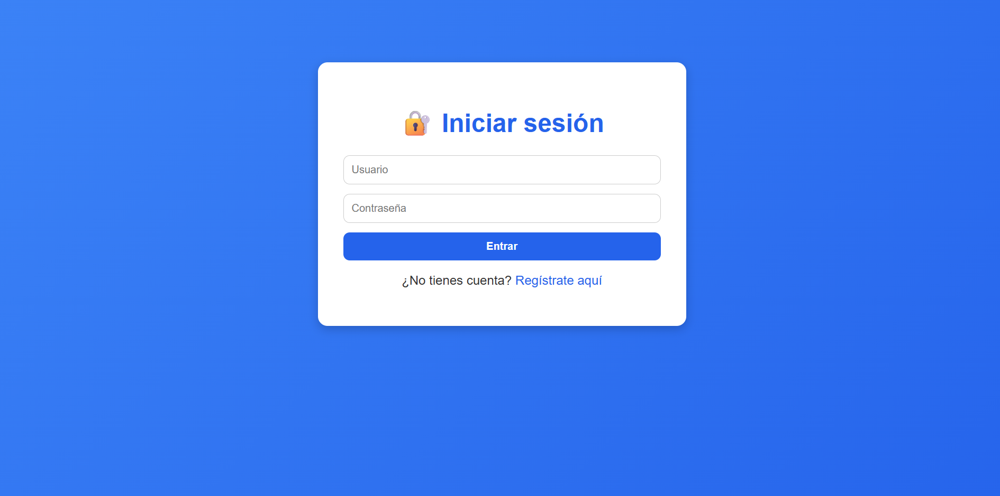
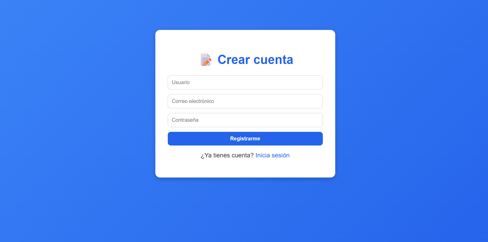
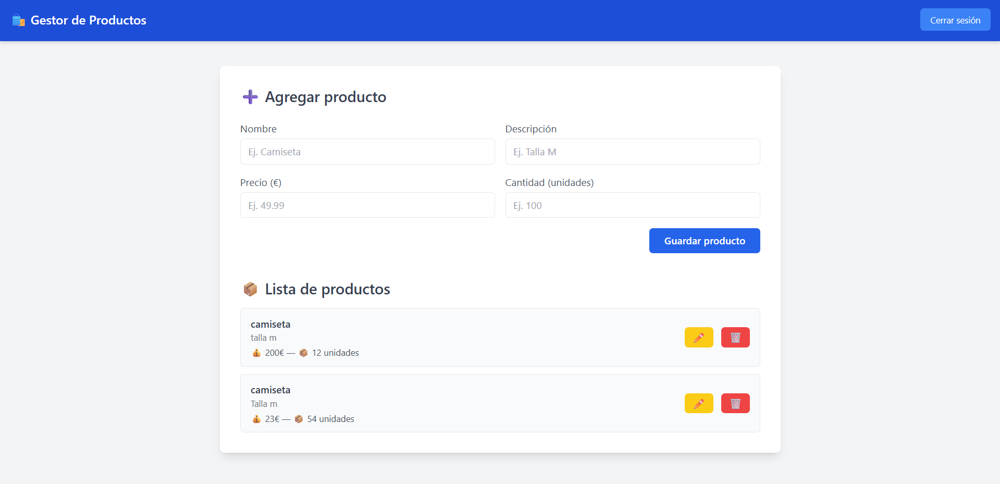
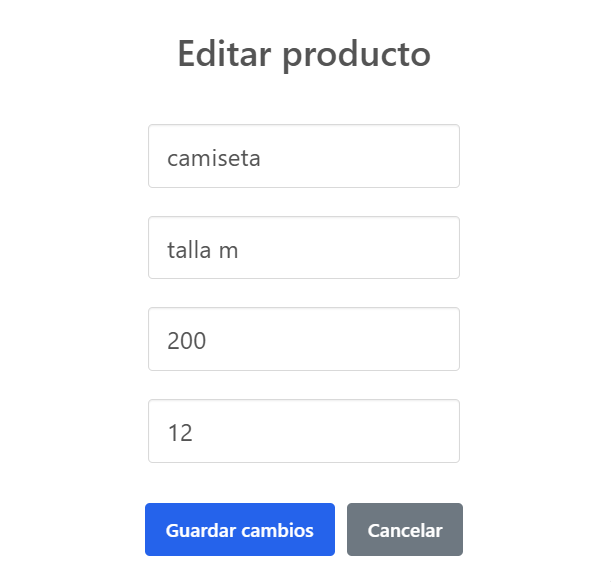

# 🧾 FastAPI CRUD – Academic Full-Stack Product Management App

This project is an **academic CRUD (Create, Read, Update, Delete) application** developed with **FastAPI (Python)** for the backend and a simple **HTML, CSS, and JavaScript** frontend.  
It demonstrates how to integrate authentication, API endpoints, and a responsive interface for managing products in a database.

---

## 🎯 Project Objective

The main goal of this project is to **learn and apply key web development concepts** by connecting a Python-based API (FastAPI) to a dynamic frontend, performing complete CRUD operations with user authentication.

---

## 🧩 Features

✅ **User Authentication**  
- Register and log in securely using JWT (JSON Web Tokens).  
- Passwords are encrypted using bcrypt.  

✅ **Product Management**  
- Add, edit, delete, and list products.  
- Each product includes:  
  - Name  
  - Description  
  - Price (€)  
  - Quantity (available stock)  

✅ **Modern Frontend Interface**  
- Built with HTML, CSS, JavaScript, and SweetAlert2 for interactive modals.  

✅ **Database Integration**  
- SQLite database handled via SQLAlchemy ORM.  

✅ **API Documentation**  
- Fully interactive Swagger UI available at `/docs`.

---

## 🧠 Tech Stack

**Backend:** FastAPI, SQLAlchemy, Passlib, Python-Jose  
**Frontend:** HTML5, CSS3, JavaScript, SweetAlert2  
**Database:** SQLite  
**Version Control:** Git + GitHub  

---
---

## 📸 Screenshots

| Login | Register | Dashboard |
|-------|-----------|------------|
|  |  |  |

| Edit Product |
|---------------|
|  |

---


## ⚙️ Installation & Setup

Follow these steps to run the project locally 👇

```bash
# 1️⃣ Clone the repository
git clone https://github.com/laportehugo68-ship-it/fastapi-crud.git
cd fastapi-crud

# 2️⃣ Create and activate the virtual environment
python -m venv venv
.\venv\Scripts\activate      # (Windows)

# 3️⃣ Install dependencies
pip install -r requirements.txt

# 4️⃣ Run the FastAPI backend
uvicorn app.main:app --reload

# 5️⃣ (Optional) Open the frontend
Start the frontend using Live Server (VS Code extension)

